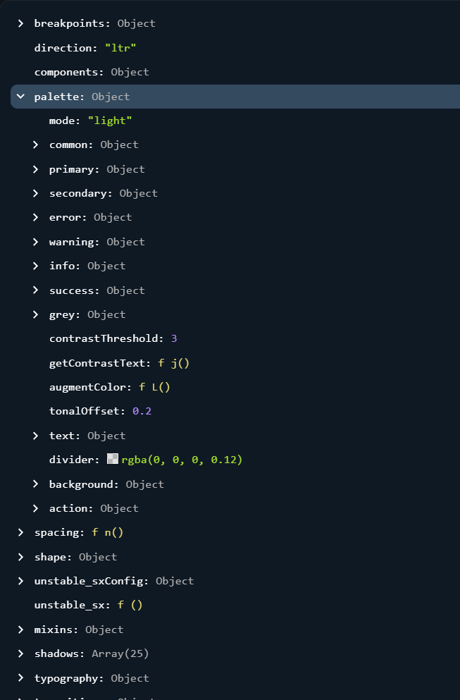
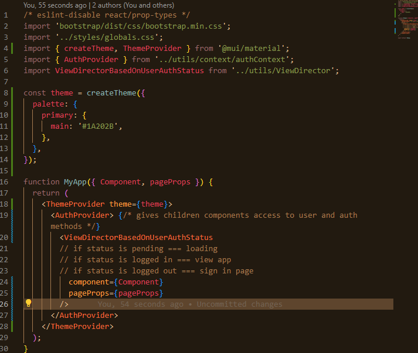

## IMPORTANT DATES
[!] CAPSTONE PROPOSAL: 11/6

[!] CAPSTONE APPROVALS: 11/6

[!] CAPSTONE PLANNING, CAPSTONE PROPOSAL PRESENTATIONS & APPROVALS: 11/6-11/18

[!] CAPSTONE CODING: 11/18 - 12/16

[!] MVP DUE DATE: 12/16

[!] MVP SOFT DEMOS AND NOTIFICATION OF PROMOTION TO BACKEND

# CAPSTONE PLANNING AND WIREFRAMINpG PHASE

ALL DRAFT WIREFRAMING IS DONE ON GOODNOTES WILL BE CONVERTED TO FIGMA.

## ERD CREATION BLUES

I'm struggling with coming up with an ERD that makes sense. These are the following pieces of data that need to be considered:
- The user's monthly salary/income.
- The user's expenses for that month.
- The category the user's expenses fall under.

Your initial thought: You can have some sort of dummy value that isn't persistent. You enter this in, and the expenses are subtracted from it. But, what happens when the page is refreshed? There's no way to keep track of it. That's why I wanted to create a table that kept track of each month's income; however, I wasn't able to connect it to the expenses and the categories without a join table, as seen in the image below:

Each month has a collection of expenses that are associated with them. These expenses are tracked. My questions is, what gets rendered? 

Manic Questions: 
- What happens when you delete a category? Do all the expenses associated with it get deleted as well? All expenses with that specific category are still expenses. Maybe you just need to warn the user to reclassify all of the expenses that have that category as a class as well. This might have to be some weird merged API data call. And, you're going to have to add those values back to the current amount. The current amount is just - the value of all the expenses that meet a certain criteria added together. So, it shouldn't be too hard. 
- You should be able to move expenses and choose which category it belongs to. Will this cause any issues on rendering?
- Chart.js??? Are we using it? Are we creating a simple bar graph to track which categories you spend the most money on?
- What is the timeline page even going to look like?

UPDATED ERD - SIMPLIFIED

### PROJECT PLANNING
> The problem of separating tickets.

- Solved through incorperating both governing functionality and assigning it to the necessary components.

### MATERIAL UI IMPLEMENTATION

> Implemented in a test-repo first. Was able to get it installed without any errors.

Theme Object: 

You can find this on the Material UI website through Default Theme Viewer

> Adding themes:

- Import the createTheme function and ThemeProvider component.
- Target the theme you want to override from the theme object. Set the primary color. 

> SASS WORKSHOP - ROB

Sass: Syntactically Awesome Styling Sheets
