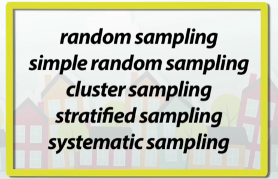

## Introductions: 
> *E25 starts today. Had some introductions. Getting used to being around everyone again is hard*

## To Leave at the Door:
- *Him. Ugh.*
- *What you should have, could have, or would have said.*
- *Any limiting ideas you're bringing with you. That you aren't there yet. That you don't have time. That you're wasting your life. That you aren't ready. You are what you are, and you're ready to change*

## IMPORTANT CONCEPTS
> Components: React is built off of components. They're the building blocks of a user interfact. Think about how, in Vanilla JS, you modularized functionality. Components are constructed similarly. They are segmented by functionality. 

> State: Data. It is the 'data' stored about a component.

> Component Lifecycle

## NEXT JS
> Next.js is a React framework for building full-stack web applications. You use React Components to build user interfaces, and Next.js for additional features and optimizations.

What I'm gathering is that, Next.JS is a framework for the React library. It takes the functionality of React and turns it into something that can stand all on its own. It gives React wings!

> Under the hood, Next.js also abstracts and automatically configures tooling needed for React, like bundling, compiling, and more. This allows you to focus on building your application instead of spending time with configuration.

Next.js kind of serves as a React version of WebPack. It helps with configuration and lets you focus on the actual development of the application. 

> Whether you're an individual developer or part of a larger team, Next.js can help you build interactive, dynamic, and fast React applications.



## JS -> REACT
#### Understanding React:
First, we need to understand how browsers interpret code to create UIs. 

> HTML --> The DOM - First, the browser reads the HTML and constructs the DOM. The Document Object Model.

- What is the DOM?: The DOM is an object representation of HTML elements. _'It acts as a bridge between your code and the user interface and has a tree-like structure with parent and child relationships'_.

- Your DOM-xperience: You've updated the DOM utilizing the document object within JS. This is how it's written:
  ```
  const renderToDom = (divId, html) => {
    document.querySelector(divId) = html;
  };
  ```
  This accesses and updates the DOM. However, as you've seen with projects that increase in complexity - this becomes very difficult to navigate and highly verbose.

- Imperative v.s. Declarative Programming: 
  AN EXAMPLE OF IMPERATIVE PROGRAMMING:
  

  _What makes programming imperative?_: Imperative sentences tell a reader what to do. It's giving instructure. Declarative sentences states a simple fact. It's used to provide information about something that is just...there. There's no expectation that x, y, or z needs to be followed. It just...is! Within Vanilla JS, you're telling the DOM exactly what you need to render, and how it needs to be rendered. In React - you're just creating a component. React is _declarative_.

- Getting Started with React:

  > ' react ' : the core React library.

  > 'react-dom' : provides DOM specific methods that enable you to use React w/ the DOM.

  Rather than using the document object within JavaScript, you can use 'ReactDOM.render()' from react-dom to simply write the HTML that you want to render.

  

  The code above; however, will not render correctly. It's because you're not utilizing a valid form of JS...it's JSX. 

  JSX doesn't have any new syntax outside of HTML and JS. Just note: that browsers don't understand JSX by itself. You need a _compiler_. This is what Babel is. Import it like you import everything else. It's just a thing you need to do a thing. Don't think TOO much about it.

  _Think about how you would create an application imperatively. How would you tackle a to-do list in Vanilla JS? How would you tackle it declaratively?_

# DAY TWO - REACT AND NEXT JS
  
## To Leave at the Door:
- *Him. Ugh.*
- *What you should have, could have, or would have said.*
- *Any limiting ideas you're bringing with you. That you aren't there yet. That you don't have time. That you're wasting your life. That you aren't ready. You are what you are, and you're ready to change*
- *Feeling like you're behind. That you need to catch up. That you're losing time. You aren't. Keep going. You need to take you're time.*

## Core Concepts of React
### COMPONENTS
> Components are the building blocks of of React. Components can be items such as navbars, buttons, images, and descriptions. These are all components. And, attached to these components are functionality. Each component is responsible for ONE thing - which builds on the modularity of Vanilla JS.

Components are **functions**. These functions typically return HTML values that build the structure.

- Examples of Components
  ```
  <script type="text/jsx">
    const app = document.getElementById("app")
  function Header() {
  return <h1>Develop. Preview. Ship. 🚀</h1>;
  }
  ReactDOM.render(<Header />, app);
  </script>
  ```
  Within the script tag of the HTML element, you're setting the type, decalring a variable (app) amd assigning it to the DOM element 'app'. Then, you're creating a function that is responsible for rendering a header. You're declaring a header by passing in an argument that is the HTML you want to render and the DOM element (app) that you wish to render those items to.

- Nesting Components

  REACT EXAMPLE
  ```
  function Paragraph() {
    return (<p> I wanna key his car. 
  I wanna make him lunch. 
  I wanna break his heart, stitch it right back up. 
  I wanna kiss his face with an uppercut. 
  I wanna meet his mom - just to tell her her son sucks!</p>);
  }

  function HomePage() {
    return (
      <div>
        {/* Nesting the Paragraph component */}
        <Paragraph />
      </div>
    );
  }

  ReactDOM.render(<HomePage />, app);
  ```
  You can nest REACT components like you would in HTML. 
  
  HTML EXAMPLE
  ```
  <div>
    <p> I wanna key his car. 
    I wanna make him lunch. 
    I wanna break his heart, stitch it right back up. 
    I wanna kiss his face with an uppercut. 
    I wanna meet his mom - just to tell her her son sucks!
    </p>  
  </div>
  ```
### PROPS
> Props are a bit like attributes within regular HTML. They add characteristics to components. Regular HTML elements have attributes like ```<src="">```, or ```<href="">```. Changing the attribute of an HTML element can change some sort of characteristic about it. Like how changing the value of an href will lead you to a different site. Similarly, you can pass components pieces of information in the form of ***props***. These props can change the behavior of the component or what is shown on the screen - depending on what you give them to do.

- EXAMPLES OF PROPS

In the image below, you're giving the 'Header' component a custom prop labeled 'title' and assigning it to a value.
  ```
  // function Header() {
  //   return <h1>Develop. Preview. Ship. 🚀</h1>
  // }

  function HomePage() {
    return (
      <div>
        <Header title="React 💙" />
      </div>
    );
  }

  // ReactDOM.render(<HomePage />, app)
  ```
  
  Your component can take 'props' as its first function parameter. This represents all the props given to the Header component, organized in the value of a function. This is where destructuring comes in!

  ```
  function Header(props) {
//   return <h1>Develop. Preview. Ship. 🚀</h1>
// }

// function HomePage() {
//   return (
//     <div>
//       <Header title="React 💙" />
//     </div>
//   )
// }

// ReactDOM.render(<HomePage />, app)
  ```
You can destructure the 'props' object. You're assigning the name of the parameter to a value, and returning what you want that value to be equivalent to. 

  ```
  function Header({ title }) {
    console.log(title) // "React 💙"
//  return <h1>React 💙</h1>
// }

// function HomePage() {
//   return (
//     <div>
//       <Header title="React 💙" />
//     </div>
//   )****
// }

// ReactDOM.render(<HomePage />, app)
  ```

### PROP TYPES
- Prop Types is an object that allows you to specify what data types the function should expect. The most common types are:
```
PropTypes.string
PropTypes.number
PropTypes.func
PropTypes.shape({})
PropTypes.arrayOf()
```
- An Example of This: 

Components that have 'color' passed to them. 
```
<Loading color="green" />

<Loading color="orange" />

<Loading color="purple" />
```

What the props.js file looks like, taking into account the prop types and default values.
```
import React from 'react';
import { Spinner } from 'react-bootstrap';
import PropTypes from 'prop-types'; // import proptypes package

// THE PROPS ARE "COLOR" AND "CHILDREN"
// PROPS IS AN OBJECT
// WE DESTRUCTURE IT SO WE CAN CALL IT BY NAME
export default function Loading({ color, children }) {
  return (
    <div className="text-center mt-5">
      <Spinner
        animation="border"
        style={{
          color,
          width: '100px',
          height: '100px',
        }}
      />
      {/* if the children prop is not passed, children will not render */}
      {children}
    </div>
  );
}

// Proptypes tell the function what data type to expect
Loading.propTypes = {
  color: PropTypes.string,
  children: PropTypes.oneOfType([PropTypes.any]),
};

Loading.defaultProps = {
  color: 'red',
  children: 'nothing here',
};
```

#### A note about JSX:
- You can utilize a variable you defined by using curly braces.
- Think of invoking curly braces as 'entering JS land'. You can add any JS expression within the curly braces. It's kinda like using template literals. 
- As you can see in the example below, you're referencing a variable.
- The reason you don't see .jsx as an extension is because BABEL is included in every template/React application creation package. No need to declare that a file is .jsx. Babel is smart enough to know that it is.

```
// function Header({title}) {
//  console.log(title)
return <h1>{title}</h1>;
// }
```

#### Iterating through a list
- You can interweave JS and JSX as seen in the example below.

```
function HomePage() {
  const names = ['Ada Lovelace', 'Grace Hopper', 'Margaret Hamilton'];

  return (
    <div>
      <Header title="Develop. Preview. Ship. 🚀" />
      <ul>
        {names.map((name) => (
          <li>{name}</li>
        ))}
      </ul>
    </div>
  );
}
```

You get a warning if you utilize the snippet above. React needs each list item to have a unique ID. Makes sense! 

```
function HomePage() {
  const names = ['Ada Lovelace', 'Grace Hopper', 'Margaret Hamilton'];

  return (
    <div>
      <Header title="Develop. Preview. Ship. 🚀" />
      <ul>
        {names.map((name) => (
          <li key={name}>{name}</li>
        ))}
      </ul>
    </div>
  );
}
```

### STATE
> Say goodbye to eventListeners! We never have to touch them again. eventListeners were responsible for adding interactivity to the UI. They listened for any changes and included custom functionality that responded to said changes accordingly. However, the whole point of React is to 'react' to changes made in data. This is what state and event handlers are for. 

**State**: Far and away the most important idea within React. State is, basically, the memory of components. It is what allows components to store information over the course of their lifecycles. Each piece of data, a count, an on/off, anything that can be represented within a data type...is state.

Whenever state within a component is updated, the component is re-rendered and a new component view is created. This allows for the UI to continuously update alongside changes in the data. It is the reason why react is so...Reactive! 

### Hooks and Using State
Functions called 'hooks' allow for you to leverage state with your components. An important hook to remember is 'useState()'. Let's look at this a little more!

> useState() - Is a hook which takes in an argument (typically the initial value/data type that we're trying to keep track of) and produces an array. This array contains the value and a callback function. Any functions that start with 'use' in React are known as Hooks. **useState can only be called at the top level of the scope. It cannot be called within if statements or loops.**

- Format of useState()
```
const [value, setterFunction] = useState(initialValue);
```
- Value: This is what you want to keep track of. Before any changes, this is equal to the argument passed through useState(). The initial value.
- setterFunction: This function handles what you're doing to the value. You call it and pass through the functionality you're enacting on the value.
- initialValue: Just as it sounds. This is the very first value you start off with - kind of like in the .reduce() array method.

> useEffect() - Another important hook. It tells React that your component needs to do something after render. Whatever function you pass to it, it'll remember, and it's something called for after DOM updates. I need a good example of this. 

## PRESENTATIONS
Things you liked: 
- It's easy now...how fast will it get hard?
- Props = Properties. Not just stage props. It's short for properties of components.
- How in-depth Johnny went with understanding state management and other core React concepts. Asking questions I didn't even know how to ask.
- How EVERYONE ELSE looked ready and ours look like the Ramblings of a mad-man. (This is sarcasm).
