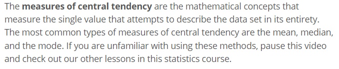

## To Leave at the Door
- *Anyhthing outside of class. You need to devote as much of your attention as possible to what's going on in class*
- *Slow your roll and focus!*
- *That there's anything you need to be afraid of. There isn't. You're here, and you're learning. That's the battle.*

### API CALLS AND MERGED DATA CALLS
> I didn't have a lot of experience with creating merged data calls. I'd say that it's the weakest thing within my wheelhouse. How can I improve? 

Thoughts:
- Follow along in class but don't code. You have to write these API calls on your own and fail. On your own.
- You understand what's going on with the React side of things. handleChange and handleSubmit are both pretty big concepts, but handleSubmit is highly dependent on having your API calls written.

Recall: 
- Promise.all()
- async, await calls
- .some(), duplicate tester
- .find(), literally the way that it sounds

Getting a Single orderBook node

My questions is always - in what ways would we utilize these API calls if we were creating our own, individual projects? When do you need to use merged data? How can I understand this so I can recognize it in any project I pursue in the future? 

### ORDERS - What components are needed? 
- A form to input an order
- A way to submit the order and have all current orders display on the screen using an OrderCard
- A way to see the details of an order and add books onto the order (books that are not already included)

EXAMPLE OF ORDERDETAILS

