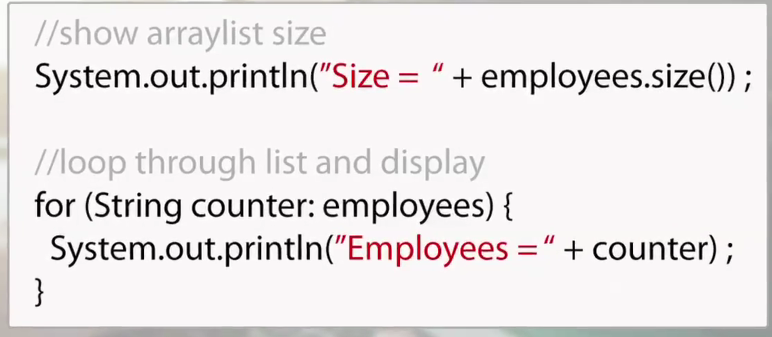

## To Leave At the Door
- *The men who hate their gfs*
- *Him. Ugh.*
- *Everything that went down last night : D !*
- *The idea that I'm behind. I am not behind. I just am as I am.*

## Agenda
- *Watching E23 presentations*
- *Recreating the Joke Generator in React*
- *Routing is on Monday*
- *Going over the counter application*
- *Going over Joke Generator*

## Counter
> NOTE: You missed the authentication part, but you don't need to yet. Just a note - most of your templates include authentication. Incorperating FireBase is a little bit of an extra step, though.

Counter Components 


Since you weren't really able to follow along, here's some of the steps that you missed on Saturday:

1. Converting the Counter functionality and styling into a component of its own.

> Some of the issues I encountered:

- Understanding how to call on and use props. Had to look back at the Joke Generator to figure this out. What is passed through the component function, deconstructed - is a prop. Examples: 

An example of props used when components are called upon.

```
      <Counter title={"Keana's Counter"} />
      <Counter title={"Salem's Counter"} />
      <Counter title={"Everyone's Counter"} />
```

An example of props, when introduced to a component function. 

```
export default function Counter({ title }) 
```
- Remember: each component has access to its own prop object. There is only one prop object per component. You also, TS style, need to specific the data types of props within propType objects. An example: 

```
Counter.propTypes = {
  title: PropTypes.string,
};

Counter.defaultProps = {
  title: 'Counter',
};
```
- I struggled with event handler functionality. I continued to get a stack overflow-esque error whenever I attempted to utilize if, else statements. Switched the switch cases and received same result - what I was missing was setting an anonymous function within the onClick invokation. Example: 

```
const handleClick = (action) => {
    switch (action) {
      case 'Increment':
        counter((prevState) => prevState + 1);
        break;
      case 'Decrement':
        counter((prevState) => prevState - 1);
        break;
      case 'Reset':
        counter((prevState) => prevState - prevState);
        break;
      default:
        break;
    }
  };
  return (
    <div
      className="text-center d-flex flex-column justify-content-center align-content-center"
      style={{
        height: '90vh',
        padding: '30px',
        maxWidth: '400px',
        margin: '0 auto',
      }}
    >
      <h1> {title} </h1>
      <h1> {counterValue} </h1>
      <button type="button" onClick={() => handleClick('Increment')}> Increment </button>
      <button type="button" onClick={() => handleClick('Decrement')}> Decrement </button>
      <button type="button" onClick={() => handleClick('Reset')}> Reset </button>
    </div>
  );
```

Notice:
```
onclick={() => handleClick('action')}
```
You left out the anonymous function declaration and just incoked the handleClick function, created outside to return block. I'm still not entirely sure why this is needed; however, it mirrors the need for a function invokation within an eventListener. For now, use this methodology until it doesn't work. 


## Counter - In Summary
> Teaches you the basics of creating components, setting prop types, and creating event handlers. It is a good introduction to how React reduces the complexity of manipulating the DOM through the creation of components. You struggled a lot with basic principles, but it looks like you're gaining some fluency. Continue to use this lesson as a guide in the future.


## Aside - Pizza Menu

> Further cementing your understanding of components and React's repeatablility. There was once a separation - each file controlled its own segment of development. CSS for styling. HTML for structure. JS for functionality. However, as you began seeing in your traversal through Vanilla JS - JS started taking control over many aspects of HTML. Very quickly, you began dynamically rendering HTML through the usage of DOM manipulation in JS files. Think back to old projects where this happened: 

_Git Sub_

> Setting the HTML to be rendered in the Overview within the JS file - NOT the HTML file.

```
const aboutMe = () => {
const domString = `<div style="font-family:'Courier New'; margin: 0.7rem 0 0 0.5rem;"><h6 style="display:flex;"><span class="material-symbols-outlined">
stadia_controller
</span>gregGroks13/greg.md</h6>
<h1>👋 Hi, I'm Greg...</h1>
<hr>
</div>
<div class="aboutme-header-img">

</div>
<div style="font-family:'Courier New';padding:0.5rem;"><p>
As a software engineer, I bring a unique blend of capabilities to the digital realm. Here's what I'm all about:
Problem-Solving Wizardry 🧙‍♂️<br><br>

Got a complex challenge? I thrive on breaking down problems into bite-sized pieces and crafting elegant solutions. My algorithmic prowess helps me navigate through the maze of logic to find the optimal path.
Multilingual Maestro 💬<br><br>

Whether it's Python, JavaScript, Java, or even the nuances of SQL, I'm fluent in a multitude of programming languages. I love conversing with code and turning abstract ideas into functional systems.
End-to-End Enlightenment 🌐<br><br>

From the front-end dazzle to the back-end stability, I've got your software's entire journey covered. Crafting user-friendly interfaces is my jam, and optimizing databases is my delight.
Learning at Lightspeed 🌟<br><br>

The tech world evolves faster than lightspeed travel, but that's where I thrive. I adapt to new technologies, frameworks, and tools like a digital chameleon, ensuring that your software stays at the cutting edge.
Collaborative Cohort 🤝<br><br>

Teamwork makes the code work! I seamlessly integrate into development teams, communicating ideas, sharing insights, and contributing effectively to ensure the collective success of projects.
Let's Code the Future! ⏩<br><br>

Whether you need a quick bug fix or a comprehensive software solution, I'm here to assist. Let's collaborate and create digital marvels that redefine the boundaries of possibility!</p></div>`
renderToDom(".aboutMe", domString); 
}
```

This is an example of how stupidly clunky rendering to the DOM dynamically can get. This is why React exists - to leverage the control JS has over the DOM...without having to interact with the DOM at all!

## Joke Generator
Joke Generator - Example of UseEffect


Joke Generator - Example of Ternary Button Functionality


Decided Against A useEffect() 


Joke funny funny 



State 


### Joke Generator - My Attempt

> components/Joke.js

```
import React from 'react';
import PropTypes from 'prop-types';

export default function Joke({ joker, btnText }) {
  return (
    <div>
      <h2> { joker.setup } </h2>
      <h2> {btnText !== 'Get a Punchline' ? joker.delivery : ''} </h2>
    </div>
  );
}

Joke.propTypes = {
  joker: PropTypes.shape({
    setup: PropTypes.string,
    delivery: PropTypes.string,
  }).isRequired,
  btnText: PropTypes.string.isRequired,
};

```

*Code Snacks - Bits of code that I didn't understand*


> pages > index.js

```
import { useState } from 'react';
import Joke from '../components/Joke';
import getJoke from '../api/jokeData';

function Home() {
  const [joke, setJoke] = useState({});
  const [btnText, setBtnText] = useState('Get A Joke');

  const getAJoke = () => {
    getJoke().then((obj) => setJoke({
      setup: obj.setup,
      delivery: obj.delivery,
    }));
    setBtnText('Get a Punchline');
  };

  return (
    <div
      className="text-center d-flex flex-column justify-content-center align-content-center"
      style={{
        height: '90vh',
        padding: '30px',
        maxWidth: '400px',
        margin: '0 auto',
      }}
    >
      <h1>Get a Joke!</h1>
      <Joke joker={joke} btnText={btnText} />
      {btnText === 'Get A Joke' || btnText === 'Get A New Joke' ? (<button type="button" onClick={getAJoke}> {btnText} </button>) : (<button type="button" onClick={() => setBtnText('Get A New Joke')}> {btnText} </button>) }
    </div>
  );
}

export default Home;
```

*Code Snacks - Bits of code that I didn't understand*


# Simply Books

> Setup is due Monday 

## Setup - Authors
- How are we going to approach this? 
> Look at how the Books is setup. What do the components look like? What components are even included? You could even use Almost Amazon as a guide for this. The following components I see within books is: 

- Edit (directory)
  > [firebaseKey].js
- [firebaseKey].js
- new.js

First: I have no idea how dynamic routes work...which is what I'm assuming the bracketed files are. 

- You need to create an author card. This is where the dynamic routes are referenced in. 


## Hooks - What are they? 

They help hook into the state/other aspects of React. You're hooking into the data and performing some sort of functionality on it. 

## Hooks in Next JS

Don't ever touch the next.js config. Use the regular image tag and then disable the linter error for the entire file.


Dynamic Routing


# 10/09/2023 - REACT: Simply Books

## Things to Leave at the Door
- Him. Ugh. Girlie, you're doing bigger and better on your own.
- Some changes are coming to NSS, and you'll be around for when things are changing.
- Going over Create today in class
- Take note of where E23 is. It's where you're gonna be next. Start thinking about backend.
- Keep going. Don't get complacent.

### 01 - React

> GET (READ) by uid

READING in Vanilla JS can be complicared. However, how it's handled in React is even More so complicated. The first thing you need to do is useState(). This will allow it so that, whenever changes are made, React will make changes to the DOM automatically without any re-rendering. 

- First: useState()
- Second: useRoute(), a custom hook from Next JS that's used in routing. Like how useAuth() is a custom hook, useRouter() is as well. 
- Next: Obtaining FBK through router query property. useRouter() produces an object.
- Forth: useEffect(). This hook tells the DOM to re-render whenever a certain function is invoked. The second parameter, which is set by an empty array by default, will tell React what values it needs to watch for re-render.

> What's a dependency array? 
The second parameter of the useEffect() hook. If a specific value changes, the function will re-render. Sometimes, it's the reason for re-rendering issues.

- Fifth: Moving on to return statement. This is where you're creating JavaScript.
- Sixth: What's up with the questions mark when querying merged data calls? - This is known as an 'Optional Chaining Operator'.
```
{bookDetails.authorObject?.last_name}
```
It's basically telling the browser to hold on and wait for the second render after this asynchronus process.

REMEMBER - it's the little things. Know how to handle data when the API call doesn't have anything to resolve. Recall how the API gives you the data and convert accordingly. These are little things from Vanilla JS that will still follow you around. Don't forget them! 

### 02 - React

> DELETE (DELETE) by uid

You solved the issue with this pretty quickly. Within the 'deleteThisBook()' function, you forgot to invoke the onUpdate() function. This made it so that the function passed through the prop wouldn't execute. Other than that, this was pretty straightforward. It works similarly to Delete within 

Importing Images: A Note
- If you want to import an image, you'll have to:
1. Import the file from the folder.
2. Call the image through {dog.src}

# 10/10/2023 - REACT: Simply Books 
Q: What's up with declaring propTypes? Why do we have to do this?
- React is STRICT and DECLARATIVE. Unless you tell it exactly what you want it to do, it's not as liberal as Vanilla JS - a qualm that many developers had with JS initially.
- It gets you ready for TypeScript. Our love. Our light.

- Going over DELETE. Once the API call is written, this is a pretty straightforward process.
1. Implement Confirmation
2. Implement an onUpdate prop.
3. Delete author as well as all author's books - this will be a merged data call.
4. You can redirect the user to a page using router.push('path'). Paths look a little different when using routes. 

EXAMPLE OF ROUTER.PUSH(...):
```
  const handleSubmit = (e) => {
    e.preventDefault();
    if (obj.firebaseKey) {
      updateBook(formInput).then(() => **router.push(`/book/${obj.firebaseKey}`));**
    } else {
      const payload = { ...formInput, uid: user.uid };
      createBook(payload).then(({ name }) => {
        const patchPayload = { firebaseKey: name };
        updateBook(patchPayload).then(() => {
          router.push('/');
        });
      });
    }
  };
```

## CREATING FORMS
1. Initial State setup and setting propTypes for the intial state and the default props.
2. Setting up the skeleton of a form. You can find this on the Bootstrap React docs.
```
function BasicExample() {
  return (
    <Form>
      <Form.Group className="mb-3" controlId="formBasicEmail">
        <Form.Label>Email address</Form.Label>
        <Form.Control type="email" placeholder="Enter email" />
        <Form.Text className="text-muted">
          We'll never share your email with anyone else.
        </Form.Text>
      </Form.Group>

      <Form.Group className="mb-3" controlId="formBasicPassword">
        <Form.Label>Password</Form.Label>
        <Form.Control type="password" placeholder="Password" />
      </Form.Group>
      <Form.Group className="mb-3" controlId="formBasicCheckbox">
        <Form.Check type="checkbox" label="Check me out" />
      </Form.Group>
      <Button variant="primary" type="submit">
        Submit
      </Button>
    </Form>
  );
}
```

EXAMPLE OF AUTHORS FORM
```
<Form>
      <h2 className="text-white mt-5">{obj.firebaseKey ? 'Update' : 'Create'} Author</h2>

      <Form.Group className="mb-3 text-white mt-5" controlId="authorFirstName">
        <Form.Label>First Name</Form.Label>
        <Form.Control type="text" placeholder="Enter Author First Name" name="first_name" value={formInput.first_name} onChange={handleChange} required />
      </Form.Group>

      <Form.Group className="mb-3 text-white mt-5" controlId="authorLastName">
        <Form.Label>Last Name</Form.Label>
        <Form.Control type="text" placeholder="Last Name" name="last_name" value={formInput.last_name} onChange={handleChange} required />
      </Form.Group>
      <Form.Group className="mb-3 text-white mt-5" controlId="authorEmail">
        <Form.Label>Email</Form.Label>
        <Form.Control type="email" placeholder="Email" name="email" value={formInput.email} onChange={handleChange} required />
      </Form.Group>
      <Form.Group className="mb-3 text-white mt-5" controlId="authorFavorite">
        <Form.Check
          type="checkbox"
          label="Favorite?"
          name="favorite"
          checked={formInput.favorite}
          onChange={(e) => {
            setFormInput((prevState) => ({
              ...prevState,
              favorite: e.target.checked,
            }));
          }}
        />
      </Form.Group>
      <Button variant="primary" type="submit">
        Submit
      </Button>
    </Form>
```

3. After setting up the skeleton form, you need to handle all changes on the form. This is the handleChange={} event handler. An example of this: 
```
  const handleChange = (e) => {
    const { name, value } = e.target;
    setFormInput((prevState) => ({
      ...prevState,
      [name]: value,
    }));
  };
```
> Code Snacks: What's happening?
- You're declaring a variable w/ the keyword const and the label 'handleChange'.
- You're assigning this variable to an anonymous function, passing in the parameter e. 
- Within this function, you're accessing the 'target' property of the event object. Once you access this, you're destructuring it and utilizing the properties 'name' and 'value'.
- Taking the setFormInput() cb function from useState(). You're taking the previous state (which is what setFormInput() returns). You're spreading prevState and dumping it into an object with the name and the value obtained from e.target.
- This is invoked everytime a change is detected by React. setFormInput() is what's responsible for keeping track of what's entered and deleted within the form.

4. After setting up the handleChange() event handler, you need to set up the handleSubmit{} event handler. An example: 
```
  const handleSubmit = (e) => {
    e.preventDefault();
    if (obj.firebaseKey) {
      updateBook(formInput).then(() => router.push(`/book/${obj.firebaseKey}`));
    } else {
      const payload = { ...formInput, uid: user.uid };
      createBook(payload).then(({ name }) => {
        const patchPayload = { firebaseKey: name };
        updateBook(patchPayload).then(() => {
          router.push('/');
        });
      });
    }
  };
```
> Code Snacks: What's happening? 
First, let's think about what submission looks like in Vanilla JS. 
```
    if (e.target.id.includes('submit-author')) {
      const payload = {
        email: document.querySelector('#email').value,
        first_name: document.querySelector('#first_name').value,
        last_name: document.querySelector('#last_name').value,
        uid: user.uid
      };
      createAuthor(payload).then(({ name }) => {
        const patchPayload = { firebaseKey: name };

        updateAuthor(patchPayload).then(() => {
          getAuthors(user.uid).then(showAuthors);
        });
      });
    }

    if (e.target.id.includes('update-author')) {
      const [, firebaseKey] = e.target.id.split('--');
      console.warn(firebaseKey);
      const payload = {
        email: document.querySelector('#email').value,
        first_name: document.querySelector('#first_name').value,
        last_name: document.querySelector('#last_name').value,
        firebaseKey,
        uid: user.uid
      };
      console.warn(payload);
      updateAuthor(payload).then(() => getAuthors(user.uid).then(showAuthors));
    }
```

What needs to happen? - You need to discern whether you're editing a pre-existing author, or if you're posting a new author to the database. BUT before that, you need to make sure that you aren't letting the form refresh. That's the default action. You need to preventDefault(). 

1. After you prevent default, you need to see whether the object has a pre-existing fbk. If so, this author already exists, and whatever formInput you have, you're patching that through updateAuthor's API call. 

2. IF NOT, and this is a brand-spanking new object, you're taking the formInput, which is the payload, and you're posting it. When you post it, FireBase spits out a name key, which is assigned to a property value. You're destructing this output and patching it onto the newly created object so that it has its own firebaseKey.

  const handleSubmit = (e) => {
    e.preventDefault();
    if (obj.firebaseKey) {
      updateBook(formInput).then(() => router.push(`/book/${obj.firebaseKey}`));
    } else {
      const payload = { ...formInput, uid: user.uid };
      createBook(payload).then(({ name }) => {
        const patchPayload = { firebaseKey: name };
        updateBook(patchPayload).then(() => {
          router.push('/');
        });
      });
    }
  };
```
