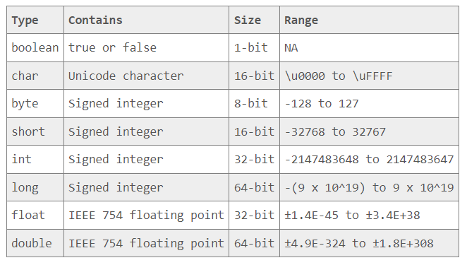
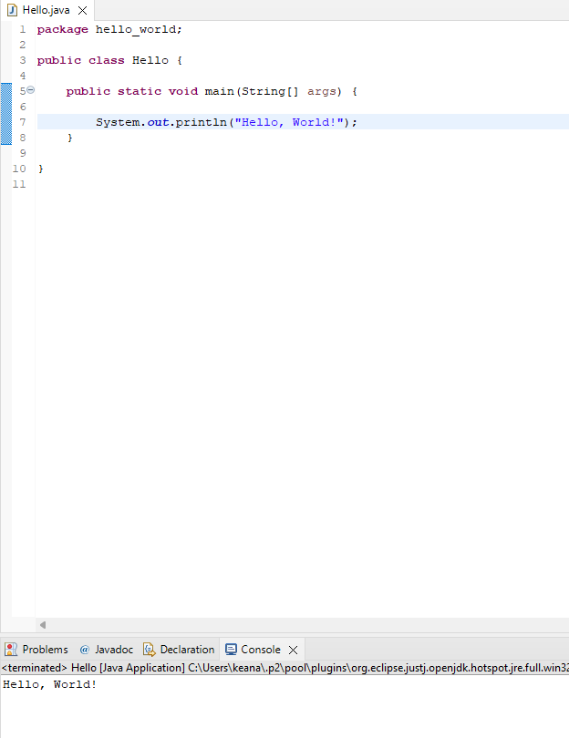

## To Leave At the Door
- *The men who hate their gfs*
- *Him. Ugh.*
- *Everything that went down last night : D !*
- *The idea that I'm behind. I am not behind. I just am as I am.*

## Agenda
- *Watching E23 presentations*
- *Recreating the Joke Generator in React*
- *Routing is on Monday*
- *Going over the counter application*
- *Going over Joke Generator*

## Counter
> NOTE: You missed the authentication part, but you don't need to yet. Just a note - most of your templates include authentication. Incorperating FireBase is a little bit of an extra step, though.

Counter Components 



Since you weren't really able to follow along, here's some of the steps that you missed on Saturday:

1. Converting the Counter functionality and styling into a component of its own.

> Some of the issues I encountered:

- Understanding how to call on and use props. Had to look back at the Joke Generator to figure this out. What is passed through the component function, deconstructed - is a prop. Examples: 

An example of props used when components are called upon.

```
      <Counter title={"Keana's Counter"} />
      <Counter title={"Salem's Counter"} />
      <Counter title={"Everyone's Counter"} />
```

An example of props, when introduced to a component function. 

```
export default function Counter({ title }) 
```
- Remember: each component has access to its own prop object. There is only one prop object per component. You also, TS style, need to specific the data types of props within propType objects. An example: 

```
Counter.propTypes = {
  title: PropTypes.string,
};

Counter.defaultProps = {
  title: 'Counter',
};
```
- I struggle with event handler functionality. I continued to get a stack overflow-esque error whenever I attempted to utilize if, else statements. Switched the switch cases and received same result - what I was missing was setting an anonymous function within the onClick invokation. Example: 

```

```

## Counter - In Summary
> Teaches you the basics of creating components, setting prop types, and creating event handlers. 

## Joke Generator
Joke Generator - Example of UseEffect


Joke Generator - Example of Ternary Button Functionality


Decided Against A useEffect() 


Joke funny funny 


State 


### Joke Generator - My Attempt

> components/Joke.js

```
import React from 'react';
import PropTypes from 'prop-types';

export default function Joke({ joker, btnText }) {
  return (
    <div>
      <h2> { joker.setup } </h2>
      <h2> {btnText !== 'Get a Punchline' ? joker.delivery : ''} </h2>
    </div>
  );
}

Joke.propTypes = {
  joker: PropTypes.shape({
    setup: PropTypes.string,
    delivery: PropTypes.string,
  }).isRequired,
  btnText: PropTypes.string.isRequired,
};

```

*Code Snacks - Bits of code that I didn't understand*


> pages > index.js

```
import { useState } from 'react';
import Joke from '../components/Joke';
import getJoke from '../api/jokeData';

function Home() {
  const [joke, setJoke] = useState({});
  const [btnText, setBtnText] = useState('Get A Joke');

  const getAJoke = () => {
    getJoke().then((obj) => setJoke({
      setup: obj.setup,
      delivery: obj.delivery,
    }));
    setBtnText('Get a Punchline');
  };

  return (
    <div
      className="text-center d-flex flex-column justify-content-center align-content-center"
      style={{
        height: '90vh',
        padding: '30px',
        maxWidth: '400px',
        margin: '0 auto',
      }}
    >
      <h1>Get a Joke!</h1>
      <Joke joker={joke} btnText={btnText} />
      {btnText === 'Get A Joke' || btnText === 'Get A New Joke' ? (<button type="button" onClick={getAJoke}> {btnText} </button>) : (<button type="button" onClick={() => setBtnText('Get A New Joke')}> {btnText} </button>) }
    </div>
  );
}

export default Home;
```

*Code Snacks - Bits of code that I didn't understand*


# Simply Books

> Setup is due Monday 

## Hooks - What are they? 

They help hook into the state/other aspects of React. You're hooking into the data and performing some sort of functionality on it. 

## Hooks in Next JS

Don't ever touch the next.js config. Use the regular image tag and then disable the linter error for the entire file.


Dynamic Routing


