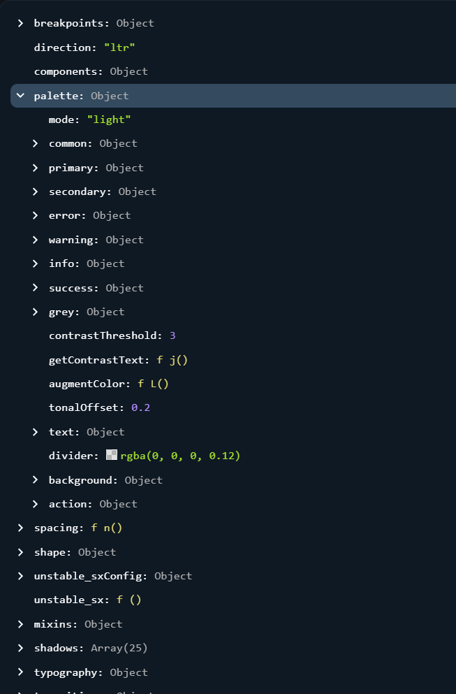

# DAY ONE - NOTES
> Theme: Awareness

> Due Dates: 11/11/2023

> Group

- Greg Markus (FE)
- Keana Cobarde (FE)
- Mark Brewer (BE)
- Sean Bryant (BE)

> Installs

- PostGress: version 15.4 (???)
- Defaults - do no launch w/ whatever it tells you to launch w/ at the very end. You may need to change your port. Default port: 5432. 
- Password Hint: Patrick is a _____
- PGAdmin: GUI for PostGress, version 15.4.1
- Visual Studio 2022 (unsure whether this is required but installing it doesn't hurt. We're using it in BE anyway)

### Database Concerns
- .env files are specific to backend.
- FireBase is still used for Authentication
- We may need to download PostGreSQL so that we can store the database locally on our machines that the backenders will make.

### TEAMS - AWARENESS CAMPAIGN

Examples of Awareness Campaigns/Ideas 
> Medical Awareness Campaigns

> Popcorn Ceilings

> Rovers on Mars: Raising awareness

What do awareness campaigns typically ask for users to do? What's the ULTIMATE goal? To inform, yes, and to also call to action. Ask for donations. Get users to be added to a list. All of these forms and functionality will need to be discussed. What EXACTLY do we want the site to do? And, what are the requirements of the hackathon?

### REQUIREMENTS
- Must have full CRUD on at least a single entity.
- Need to have at least a one-to-many relationship.
- Need to have at least one many-to-many relationship.
- Must be user-specific.
- Must follow the assigned theme
- Must be full-stack (BE: C#/.Net, FE: React)

The biggest challenges are implementing 1 to or many to many relationships. How are we going to implement this? We can create an order system. We can create a donation page, we can create other little things.

# DAY TWO - NOTES 

Things I want to address: 
- Getting the repo copied and the issue tickets/PR templates implemented
- Expectations for timelines. When do we want MVP done? This should be decided alongside the theme. Have open communication down.
- Agree on our main communication source.
- Get planning started. How long will this take? Planning typically takes a few days. This is a discussion we'll have to have. [Answer: We're going to need to know what components are present]
- Sharing the ideas I have. NASA's rovers are my Roman Empire. What will everyone else think about this?

MAIN IDEAS: 
- Get the functionality decided. It's about the data. When functionality is decided, based on our objective as an 'awareness campaign', everything else will come.

Ideas: 
> Creating a hub for other awareness campaigns that are all hosted in a specific place. You can create awareness campaigns. We can create categories for each post. This handles a one to many relationship. 

Post - Users can post awareness campaigns once they are authenticated.

One to many: A post can only belong to one user, but a user can create many posts.
Many to Many: A post can belong to many categories. A category can belong to many posts.

- Note: pgAdmin has an uppercase first letter, it's ACTUALLY lowercase. This will become important when you start implementing endpoints.

# SATURDAY - INTETGRATION PROBLEMS
- Changed over from FireBase to the PostGres endpoints. Chaos ensued. 
- Common errors: 

ERRORS WITH API CALL IMPLEMENTATION. We're going from some remote database to a database built by the backend. It's having some trouble communicating in implementation. Swagger works. Postman works. It's just fetching it that ISN'T working. We're wondering whether it's a syntax error, or it's some sort of security error. Maybe it has something to do with the database. Maybe not.

 CORS ERROR

