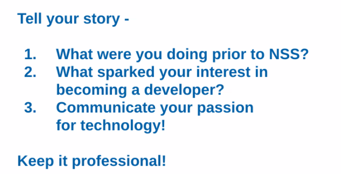

# LinkedIn - The foundation of your Technical resume

- What should you include?
- How are you going to include NSS into your LinkedIn?
- How are you going to build yourself up? You're already trying to learn how to create content with it.

## Parts of a LinkedIn
- About
- Technical and Professional Experience
- Projects, projects, and more projects! Preferably deployed with Netlify and others depending on the backend.
- Education: When it comes to getting your degree, is it necessary? How do you include it?
- Make sure that you have a banner! 

- Add Featured projects/articles. What are the FIRST things you want people to see when they land on your profile?

- There is a whole folder with stuff. Use it. - https://drive.google.com/drive/folders/1WWI3vDXVozviwdhFze7gSDJNxSuK3JIK

- Include NSS as experience. DONE.

Questions to Ask on Outreach
- What are you currently working on?
- Be nice, but also know that you're networking on LinkedIn.
- It's about someone in the crowd. Ask someone. That someone might know someone.
- You need to get to the positions that are opening up BEFORE the job is opening up.
- Start networking with NSS alumns.
