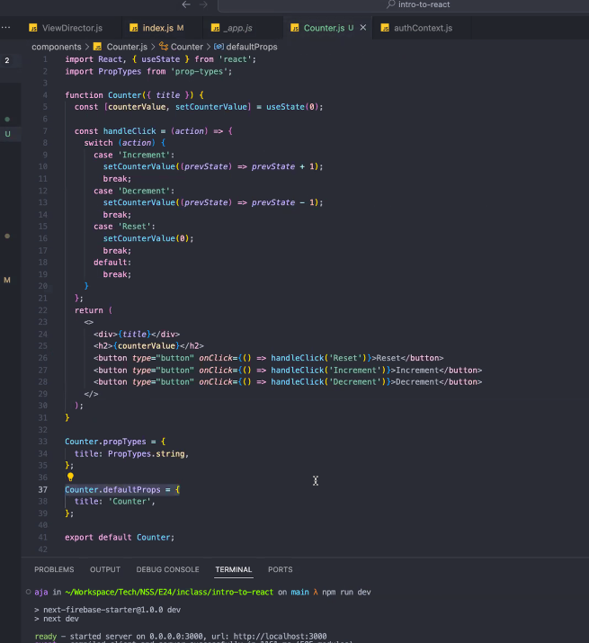
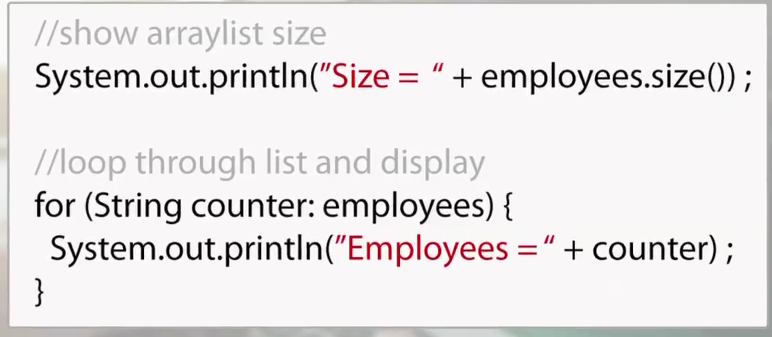
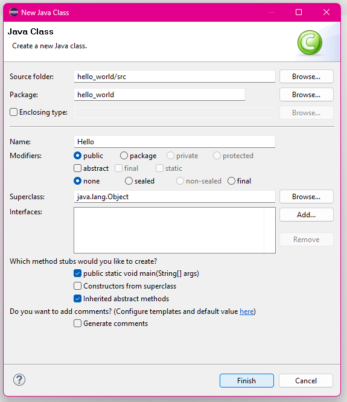
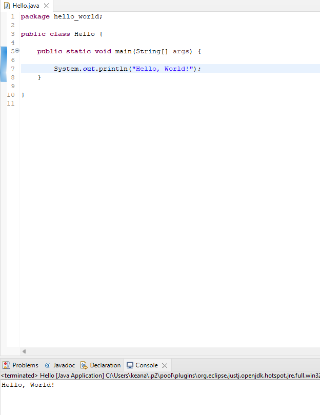

# CHAPTER TWO - BUILT-IN DATA TYPES FOR PROGRAMMING

### Java Type Conversion


There's **implicit conversion** and **explicit conversion**. Depending on whether the data type that the value is being converted takes up more or less space than the type it was before will govern whether or not Java can implicitly convert it or whether it will need to be explicitly converted. 

IMPLICIT CONVERSION
```
// My age in years
byte myAge = 23;    //(8 bits)
// Arbitrary integers
long someNumber;    //(64 bits)
int anotherNumber;    //(32 bits)
// My age plus a fractional year
double myAgePlus;    //(64 bits)
// Implicit conversion
someNumber = myAge;    //8 bits to 64 bits
/* someNumber implicitly converted to 64-bit; then a floating point
value of 0.5 is added. Result is then stored in myAgePlus */
myAgePlus = someNumber + 0.5;
/* These implicit conversions are NOT allowed!
Java will report an error */
anotherNumber = someNumber;
float anotherAge = myAgePlus;
```

EXPLICITY CONVERSION
```
// Arbitrary integers
long someNumber = 123;    // (64 bits)
int anotherNumber;    // (32 bits)
// First letter of the alphabet
char firstLetter = 'A';    // (16 bits)
// Explicit conversions using a type-cast
// Cast down from 64 bit to 32 bit
anotherNumber = (int) someNumber;
/* Cast from a char (16 bits) to a 16-bit integer. The
Unicode value for capital 'A' is \u0041 (which is 65 decimal),
so the 16-bit integer value of 65 will be stored in letterValue. */
short letterValue = (short) firstLetter;
```

# CHAPTER THREE - CONDITIONALS AND LOOPS IN PROGRAMMING

You know a lot of these concepts from JavaScript and your experience with other programming languages. Don't spend too much time re-inventing the wheel.

> What IDE do you even use with Java, anyways?
- Eclipse
- NetBeans
- IntelliJ
- VSCode (with some caveats)

# CHAPTER FOUR - ARRAYS IN JAVA


### Java ArrayList Add Method: Code & Examples
> ArrayList: A class that allows for an array to be dynamic. 

You're declaring the ArrayList method, after importing it, declaring the data type of the array and the label, then you're standing a new ArrayList instance with the data type and the length.

```
ArrayList <String> employees = new ArrayList <String>(5);
```

ArrayList in action.


You can utilize the .add() to add elements to the array. If the index isn't specified, Java just adds it to the end of the array, and increases the amount of buckets by one.

.add() takes two parameters, by the way! - it takes an index as well as the element that goes into the bucket.

```
employees.add("Jane Eyre");
employees.add("Sherlock Holmes");
employees.add("Edmond Dantes");
employees.add("Jean Valjean");
employees.add("Sam Spade");
```

ArrayList of Classes

```
//*** ArrayList of Classes
ArrayList <Artist> artist = new ArrayList < > ();
artist.add(new Artist(1025, "REO Speedwagon"));
artist.add(new Artist(9067, "Meat Loaf"));
```


```
//show arraylist size
System.out.println("Size = " + employees.size());
 
//loop through list and display
for (String counter : employees) {
 System.out.println("Employee = " + counter);
}
```

> Setting up Eclipse IDE - Hello, World!

I honestly didn't think they'd take the GUI approach to setting up the Java Class that we're creating. I wonder hopw close the idea of 'Class' in Java is to the idea of what a class is in JavaScript. They're two completely different languages, but they have object-oriented paradigms. 




