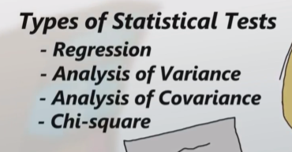

"The sexiest job in the 21st century will be that of a statistician." - Some wise individual who somehow predicted the rise of machine learning, big data, and the coolest science in the world- data science.

# CHAPTER ONE - OVERVIEW OF STATISTICS

### 1.1 - DESCRIPTIVE AND INFERENTIAL STATISTICS

Vocabulary: 

> Population: A group in which information is collected from. Doesn't have to refer to 'people'. Can be people, things, animals, etc. 

> Data: Information that is collected from the population. 

Descriptive Statistics: 
- give information that describes the data in some manner.

Inferential Statistics: 
- makes inferences about populations using data drawn from them. This immediately makes me think...what's the difference between inferential statistics and predictive analysis?

- best for large groups of populations. A small sample is taken from the population and inferences are drawn about the greater population based on that group...which can lead to some messy sitautions but I don't judge.

- answers will never be 100% accurate. it uses probability.

_Examples of Inferential Statistics_

 - Probability distributions
 - hypothesis testing
 - correlation testing
 - regression analysis

 ### 1.2 - DIFFERENCE BETWEEN POPULATIONS AND SAMPLES IN STATISTICS

| Population     | Sample |
| :---        |    :----:   |
| - All members of a specified group.    | - A part of a population used to describe the whole group.       | 

 ### 1.4 - ESTIMATING A PARAMETER FROM SAMPLE DATA

 Vocabulary: 

 > Parameter: 
 a characteristic used to describe a population

 > mu: A Greek symbol used to refer to 'mean' or 'average' of a population. This is almost another way to refer to a parameter. Kinda interesting that the parameter is the same thing as the mean. Some neat theoretical hoops to be had there. 

 > Types of sampling: 

 

 > Statistic: characteristic of a sample used to infer information about the population.

 > Confidence interval. 

 Remember: 

- Parameters are used to describe POPULATIONS.
- Statistics are inferred from SAMPLES to describe the population. Recall. Samples are a PART of the population used to represent the population. 
- The example given during the video is simple enough that it is easy to find a parameter from the sample. The statistic is, 1 in 3 people surveyed own a pet. We can infer that the parameter is: 1 in 3 people own a pet.

Advanced Parameters: 
- Big idea: you have to think about context. You're not going to use the data surveyed from individuals who are outside of your population, but you're also not going to collect data under circumstances that are biased towards a certain conclusion. 

SAMPLE FROM STUDY.COM

Josephina wants to know if pet owners would be interested in footwear for their pets. She surveys people at the movie theater and at the dog park. Everyone is required to answer the question, even if they don't own a pet. Considering that Josephina's population is all pet owners in the town, which piece of information should she use to develop a parameter?

Because Josephina's population is all pet owners, she needs to use the data she collected from the dog park only. Even though she found some pet owners at the movie theater earlier, remember that everyone is required to answer the question, so the people at the movie theater don't fit the population and, therefore, would not be an accurate sample. If Josephina finds that 78% of the people in the dog park would be interested in footwear for their pets, can she use this as a parameter?

What do you think? Can Josephina assume that because 78% of the people in the dog park would be interested in footwear for their pets, that 78% of the pet owner population also would be interested? This is a tricky question. Technically, the statistic 78% is an accurate sample of the population. However, other factors may need to be considered. For example, it sounds like Josephina only surveyed dog owners, but her business is for all pets. To get a more accurate parameter, Josephina may need to conduct her survey with other pet owners.

On the other hand, Josephina can get more accurate results if she surveyed people at the movie theater, asking first if they owned a pet, and then only asking the pet owners if they would be interested in footwear for their pets. When she does this, she finds that about 64% of the pet owners surveyed are interested in footwear for their pets. She can more accurately infer that 64% of the pet owners in the town would also be interested. This means that she can use the statistic, 64%, to infer the parameter, 64%.

## 1.9 - THE PURPOSE OF STATISTICAL MODELS

> The purpose of statistics is to describe and/or predict data. 

* NOTE - STATISTICAL MODELS ARE USED ONLY IN INFERENTIAL STATISTICS. Note the prediction. Descriptive statistics is focused on gleaning more information/describing a population - not predicting outcome. 

* ANOTHER NOTE - MODELS ARE IDEALISTIC. REALITY IS ALWAYS A LOT MORE COMPLICATED.

TYPES OF STATISTICAL MODELS

VARIABLES

- Response: The observed variable, or the variable in question. Similar to a dependent variable. 

- Exaplanatory: A variable or a set of variables that can influence the response variable. Similar to the independent variable in the scientific method. They can't always be controlled or change.

- Collected in the form of data that can either be cateogrical or quantitative. 

| Categorical      | Quantitative |
| :---        |    :----:   | 
| - Ordinal or nominal      | - Discrete or continuous       | 

Nominal Data: Assigns numerical values to objects. 

Ordinal Data: Data that can be ordered or ranked but not measured. 

Discrete Data: Data that cannot be divided. Discrete and can only occur in specific values. 

Continuous Data: Data that can be infinitely divided. Does not have any value distinction.
